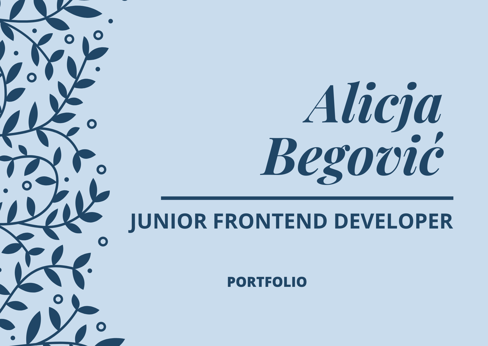

# Portfolio - Alicja Begović

***Welcome on my page! My name is Alicja.***

## General info

Here I would like to present project which I wrote during course WTF: what the frontend. Project for me was quiet challenging but in the end I am really satisfied with final result.

## Technologies

- HTML,
- CSS / SASS,
- POSTMAN,
- JavaScript,
- Node.js.

## Setup

To run this project, you can use:

```
    git clone [paste link from repository]
```

And in node:

```
    npm install

    npm start
```